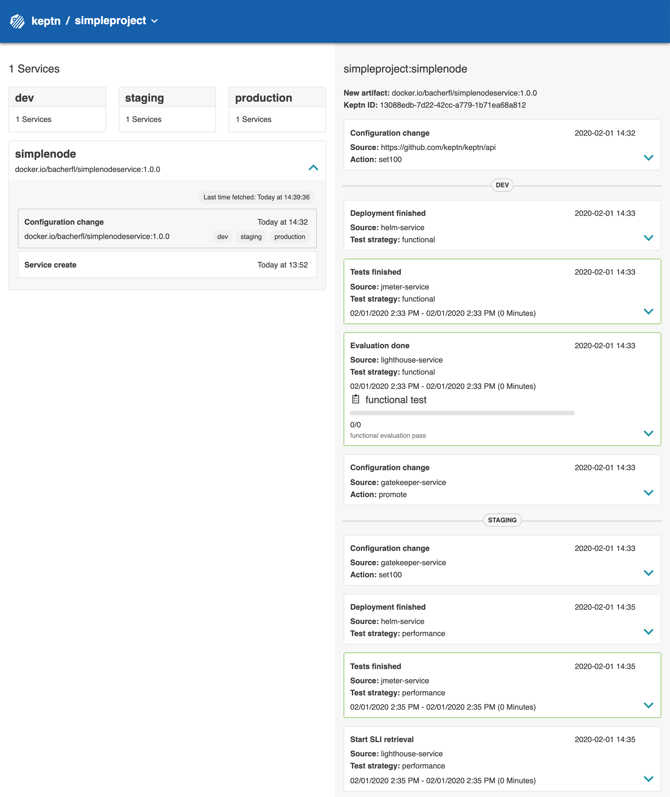
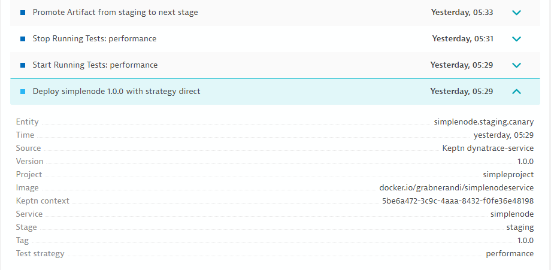

**Introduction to Autonomous Cloud with Keptn** workshop given @[Dynatrace Perform 2020](https://https://www.dynatrace.com/perform-vegas//)

At this point, we have a Keptn project created and the simplenode service onboarded to the project.

# Excercise 2: Deploying the Simplenode service

1. In this exercise, we will automatically configure Dynatrace for perfectly supporting the continous delivery journey our **simplenode** service has to go through. Additionally, testing files will be configured and Keptn's quality gate is set up. 

1. Then, we hit the trigger to launch the deployment of the **simplenode** service. 

## Let's get ready for the Deployment

### Configure Dynatrace 

We can use Keptn to automatically generate a Dynatrace dashboard and management zones for our *simplenode* project. 

* To create a Dynatrace **Dashboard** and **Management zones**, execute:

    ```console
    keptn configure monitoring dynatrace --project=simpleproject
    ```

* Afterwards, you can view your generated Dashboard under: `https://<YOUR_DYNATRACE_TENANT>/#dashboards`

### Configure Tests

Now, we set up the tests in our continuous delivery process. In this workshop, we will use JMeter for testing.

* Please make sure that you are in the correct folder on your bastion host: 

    ```console
    cd ~/getting-started/keptn-onboarding
    ```

* To active **functional tests** in *dev* stage, execute: 

    ```console
    keptn add-resource --project=simpleproject --service=simplenode --stage=dev --resource=jmeter/basiccheck.jmx --resourceUri=jmeter/basiccheck.jmx
    ```
<!--
* To active **load tests** in *dev* stage, execute: 
```
keptn add-resource --project=simpleproject --service=simplenode --stage=dev --resource=jmeter/basiccheck.jmx --resourceUri=jmeter/load.jmx
```

* To active **functional tests** in *staging* stage, execute: 
```
keptn add-resource --project=simpleproject --service=simplenode --stage=staging --resource=jmeter/basiccheck.jmx --resourceUri=jmeter/basiccheck.jmx
```
-->

* To active **load tests** in *staging* stage, execute: 
    ```console
    keptn add-resource --project=simpleproject --service=simplenode --stage=staging --resource=jmeter/load.jmx --resourceUri=jmeter/load.jmx
    ```

### Activate Keptn's Quality Gate

After all, we do not want to blindly send artifacts into production but want to ensure that our performance criteria are met. Therefore, we must first configure Service Level Objectives and then .

* To add the **SLO** file to the **staging** stage: 

    ```console
    keptn add-resource --project=simpleproject --service=simplenode --stage=staging --resource=slo.yaml
    ```

* Now, we will tell Keptn to use the **dynatrace-sli-service** as a value provider for our Service Level Indicators. We will do this using a ConfigMap:

    ```console
    kubectl apply -f lighthouse-config.yaml
    ```

## Ready for the Deployment

* We are now ready and can run our first deployment of the **simplenode** service. Therefore, execute the following command:
   
    ```console
    keptn send event new-artifact --project=simpleproject --service=simplenode --image=docker.io/bacherfl/simplenodeservice --tag=1.0.0
    ```
   
:mag: As the deployment runs you can watch the progress, take a look into:

**a) Keptn's bridge**


**b) Dynatrace**

Keptn pushes events to those Dynatrace Service entities that match the `keptn_project`, `keptn_service`, `keptn_stage` and `keptn_deployment` tags:


# Result

After a couple of minutes, the **simplenode** is deployed in your K8s cluster. You can retrieve the URLs for the simplenode service for each stage as follows:

:heavy_check_mark: Dev stage: 
```console
echo http://simplenode.simpleproject-dev.$(kubectl get cm keptn-domain -n keptn -o=jsonpath='{.data.app_domain}')
```

:heavy_check_mark: Staging stage: 
```console
echo http://simplenode.simpleproject-staging.$(kubectl get cm keptn-domain -n keptn -o=jsonpath='{.data.app_domain}')
```

:heavy_check_mark: Production stage: 
```console
echo http://simplenode.simpleproject-production.$(kubectl get cm keptn-domain -n keptn -o=jsonpath='{.data.app_domain}')
```

:mag: Navigate to the URLs to inspect your **simplenode** service. In the production namespace, you should receive an output similar to this:

**TODO: IMAGE IS MISSING!!**


---

[Previous Step: Onboarding simplenode service](../01_Onboarding_simplenode_service) :arrow_backward: :arrow_forward: [Next Step: Exploring quality gates](../03_Exploring_quality_gates)

:arrow_up_small: [Back to overview](https://github.com/keptn-workshops/getting-started#overview)