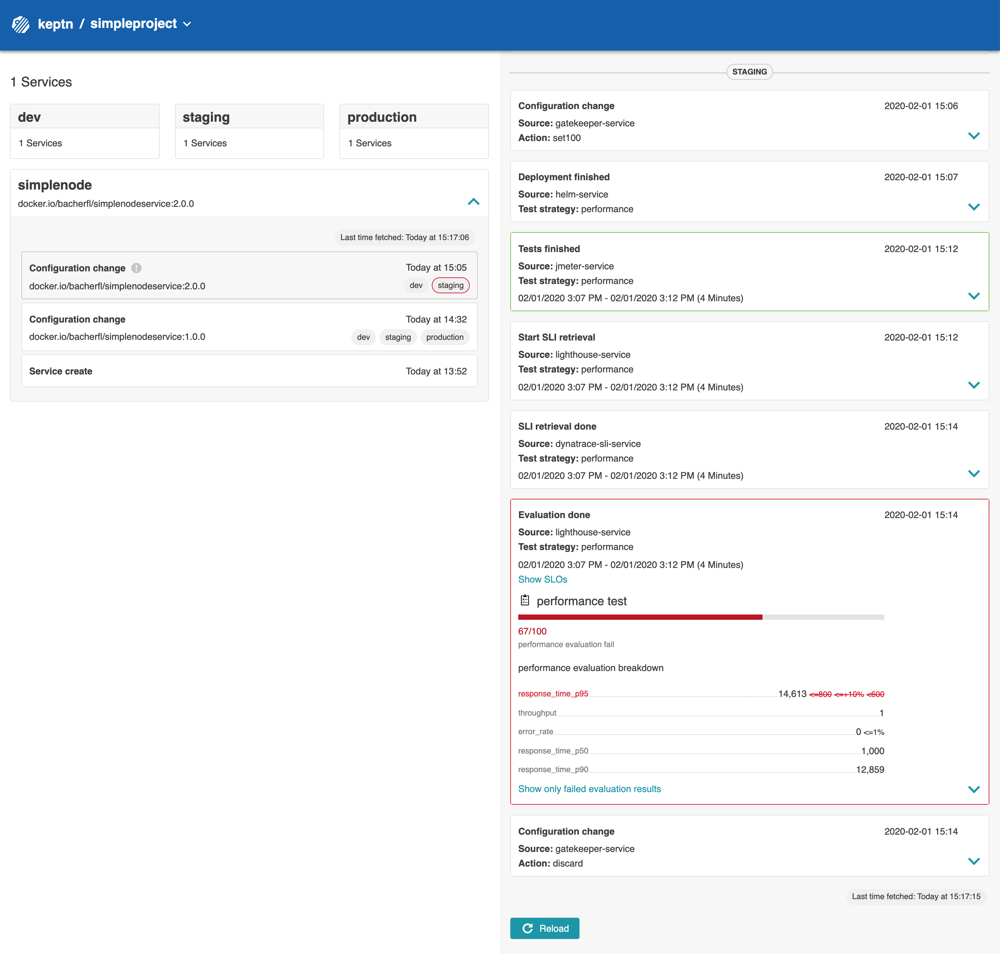
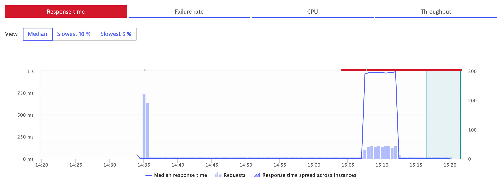

**Introduction to Autonomous Cloud with Keptn** workshop given @[Dynatrace Perform 2020](https://https://www.dynatrace.com/perform-vegas//)

At this point, the simplenode service has been deployed for the first time and the quality gate for staging has been activated by providing an SLO file for *staging*.

# Exercise 3: Exploring Keptn's Quality Gates

When developing an application, sooner or later you need to update a service in a production environment. To conduct this in a controlled manner and without impacting end-user experience, the quality of the new service has to be ensured and adequate deployment strategies must be in place. For example, blue-green deployments are well-known strategies to roll out a new service version by also keeping the previous service version available if something goes wrong.

1. In this exercise, deploy a version of the **simplenode** service that has a slower response time compared to the previous version. Since we have activated the quality gate, we expect that the weaker performance gets detected and the service will not be promoted to production.  

1. Finally, we again deploy the previous version of the **simplenode** service expecting a pass by the quality gate.

## Deployment of a SLOW implementation of the Simplenode service

To demonstrate the benefits of having quality gates, we will now deploy a version of the simplenode service with terribly slow response time. 

* To trigger the deployment of this version, please execute the following command:

    ```console
    keptn send event new-artifact --project=simpleproject --service=simplenode --image=docker.io/bacherfl/simplenodeservice --tag=2.0.0
    ```

### Promotion from Dev to Staging

After some time, this new version will be deployed into the `dev` stage. If you look into the `shipyard.yaml` file that you used to create the `simpleproject` project, you will see that in this stage only functional tests are executed. 

This means that even though the version has a slow response time, it will be promoted into the `staging` environment because it is working as expected on a functional level. 

:mag: You can verify the deployment of the new version into `staging` by navigating to the URL of the service:

```console
echo http://simplenode.simpleproject-staging.$(kubectl get cm keptn-domain -n keptn -o=jsonpath='{.data.app_domain}')
```

### Keptn's Quality Gate detects Performance leak - NO Promotion to Production!

As soon as this version has been deployed into the `staging` environment, the performance tests are executed.
When those are finished, Keptn will evaluate them against the defined *Service Level Objectives* (SLOs) using Dynatrace as *Service Level Indicator* (SLI) provider. 

:boom: At this point, it will detect that the response time of the service is too high and mark the evaluation of the performance tests as `failed`.

As a result, the new artifact will not be promoted into the `production` stage. Additionally, the traffic routing within the `staging` stage will be automatically updated to send requests to the previous version of the service. 
   
:mag: You can explore the reason for the failed evaluation in Keptn's Bridge as well as Dynatrace:

**a) Keptn's Bridge**
The Keptn's Bridge gives you a detailed view of the evaluation result (i.e. all SLIs values).
This includes the response time metric, which caused the evaluation to fail.



**b) Dynatrace**

Dynatrace analyzed a high response time for the `SimpleNodeJsService` in staging.



## Deployment of the previous Simplenode service 


* Finally, deploy the previous version of the **simplenode** service, which has to pass the quality gate:

    ```
    keptn send event new-artifact --project=simpleproject --service=simplenode --image=docker.io/bacherfl/simplenodeservice --tag=1.0.0
    ```

## Result

The slow version was not promoted to the production environment because of the active **Keptn's Quality Gate** in place.

---

[Previous Step: Deploying simplenode service](../02_Deploying_simplenode_service) :arrow_backward: :arrow_forward: [Next Step: Automatic remediation](../04_Automatic_remediation)

:arrow_up_small: [Back to overview](https://github.com/keptn-workshops/getting-started#overview)