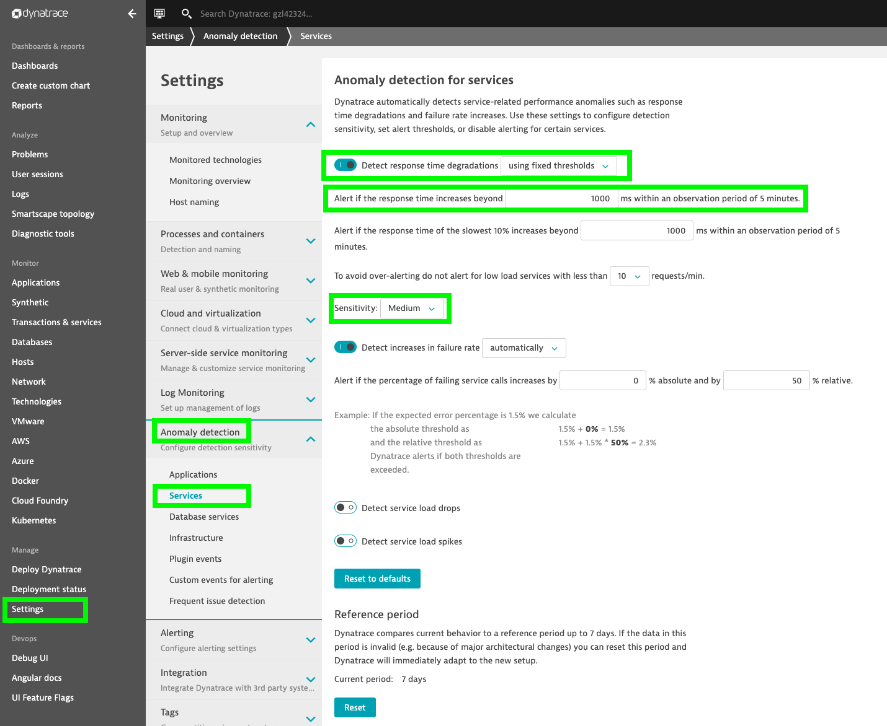
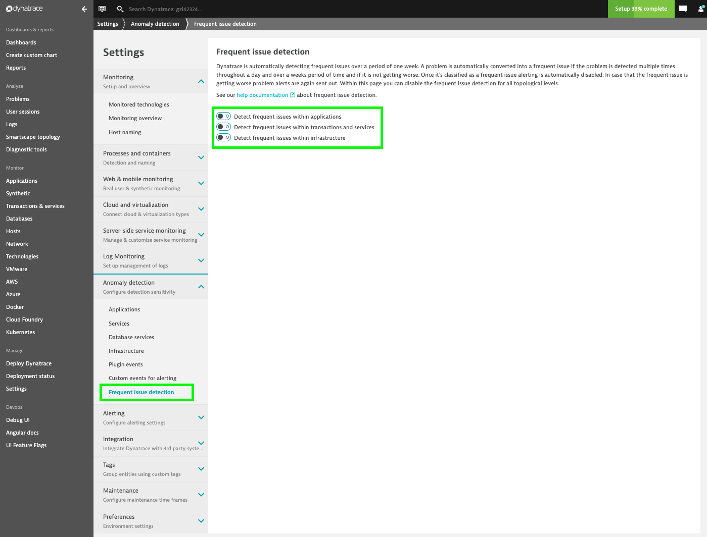
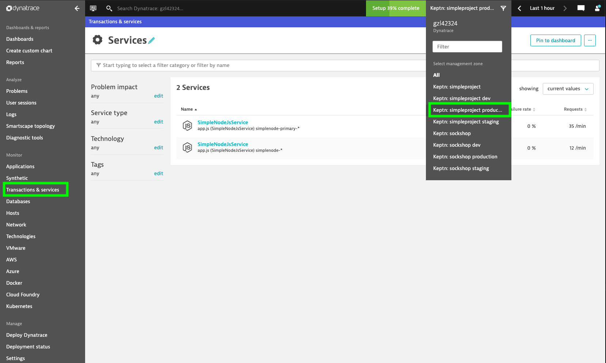
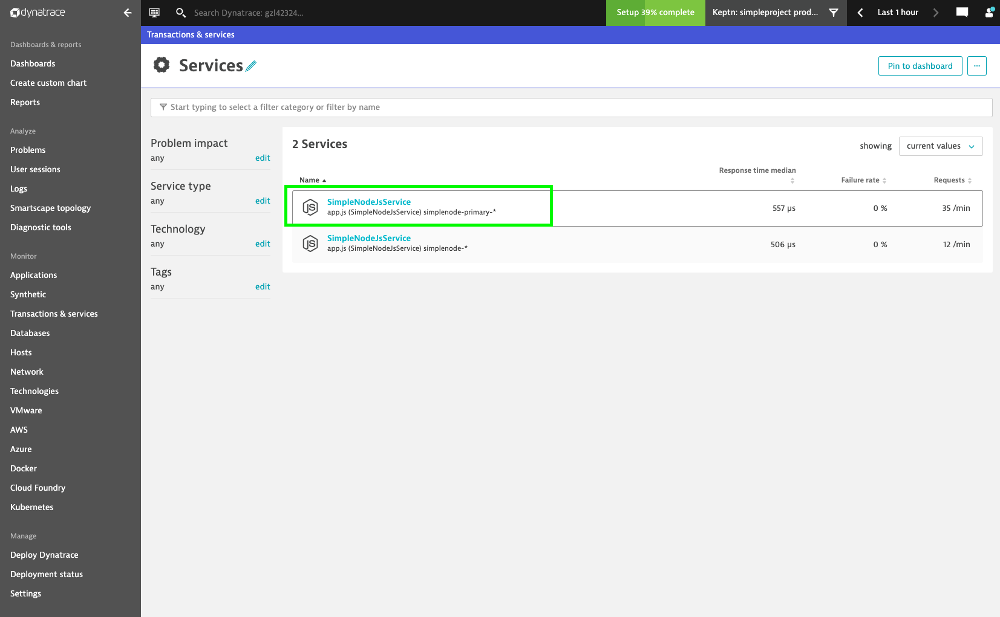
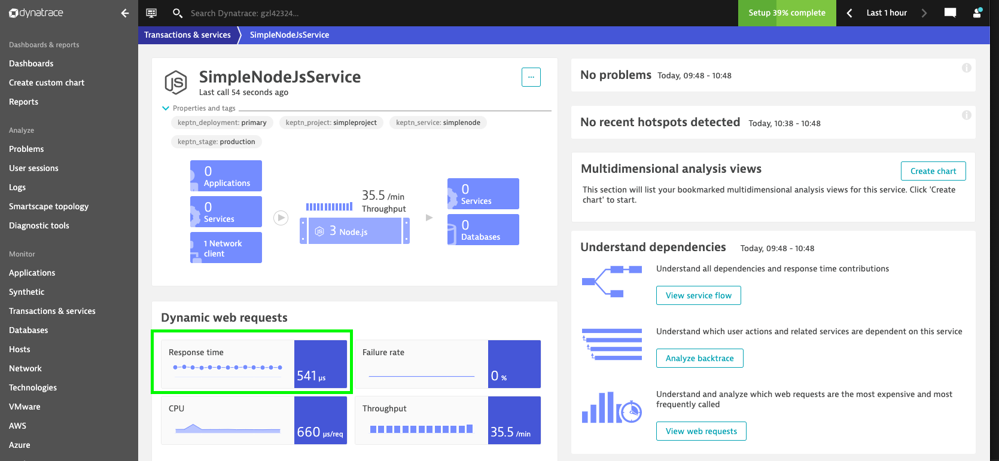
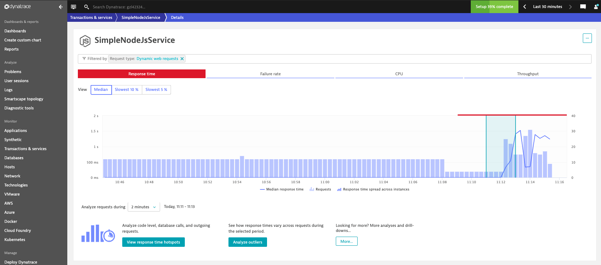
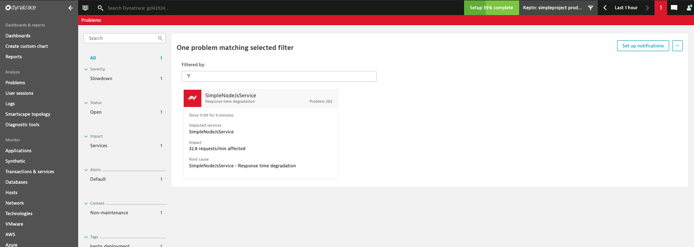
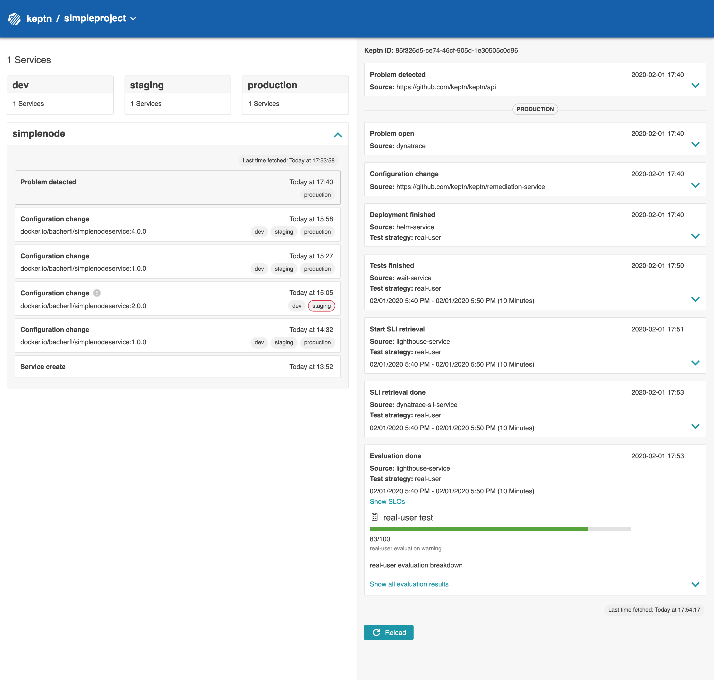
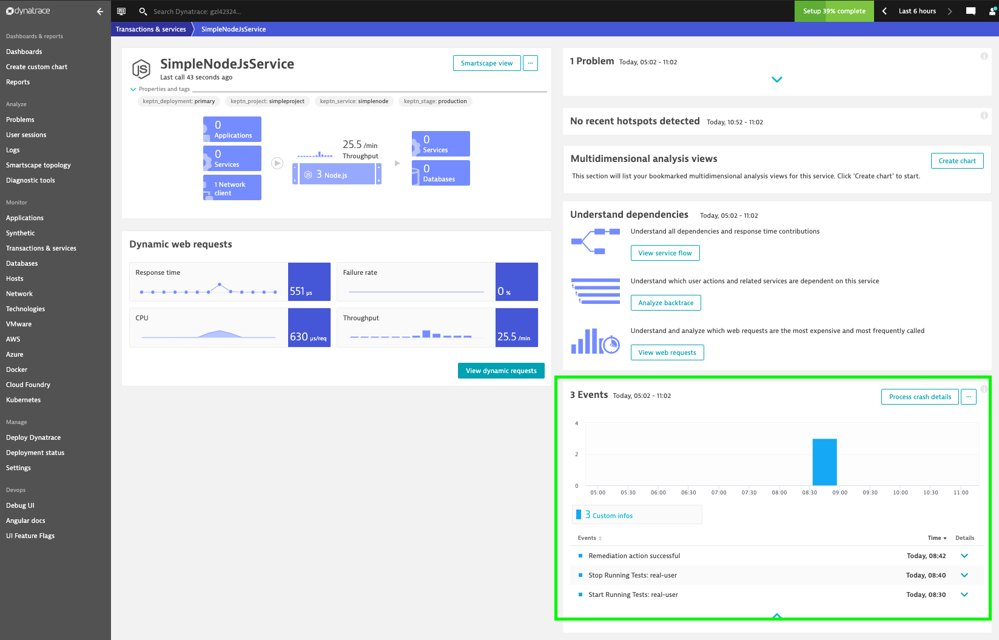
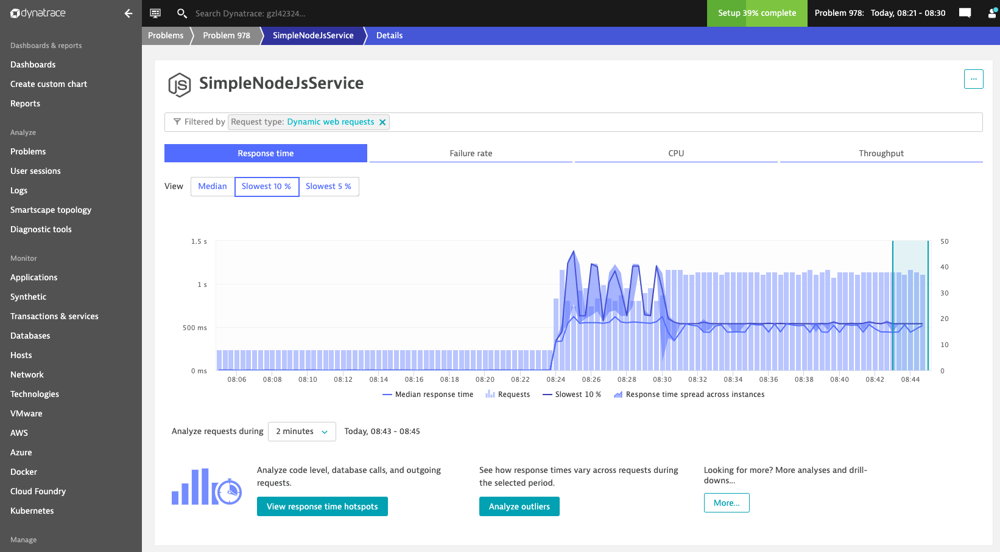

**Introduction to Autonomous Cloud with Keptn** workshop given @[Dynatrace Perform 2020](https://https://www.dynatrace.com/perform-vegas//)

In the previous lab, we have learned how Keptn can be used for continuous delivery including quality gates.
However, even a deployed service can have issues that only arise in production.
For example, an unhealty state of the service can be caused by untested parts of the microservice that have issues,
an overload, or a wrong configuration.

# Exercise 4: Self-healing in action

In this exercise, we use the deployed Simplenode service, which passed the quality gates.
However, this version of the Simplenode service has a hidden flag that causes the service to fail frequently while it is in production. 
Dynatrace will detect this problem and will send a problem event to Keptn.
Using predefined remediation actions, we can tell Keptn how to automatically remediate problems of certain problem types. 
By this, we can implement a self-healing mechanism for our Simplenode service.

## Configure Remediation Actions

Keptn allows to configure remediation actions for different problem types.
Therefore, Keptn uses a so-called `remediation.yaml` file, which contains a list of problems and their corresponding remediation actions.
The `remediation.yaml` file used in this exercise looks as follows:

```yaml
remediations:
- name: Response time degradation
  actions:
  - action: scaling
    value: +2
```

:mag: By using this file, Keptn will react to problems that cause a **Response time degradation** with scaling up the number of replicas running our service. In this case, we will increase the replica count by 2 pods. 

* Please make sure that you are in the correct folder on your Bastion host:

  ```console
  cd ~/getting-started/keptn-onboarding
  ```

* To configure the remediation action for Keptn, execute the following command: 

  ```console
  keptn add-resource --project=simpleproject --service=simplenode --stage=production --resource=remediation.yaml
  ```

* We can also add another SLO file (in this case to our production stage) to verify if our remediation action has been successful. Execute the following command: 

  ```
  keptn add-resource --project=simpleproject --service=simplenode --stage=production --resource=slo-self-healing.yaml --resourceUri=slo.yaml
  ```

## Configure Dynatrace Problem Detection

For the sake of the workshop, we will configure Dynatrace to detect problems based on fixed thresholds. 

* In your Dynatrace Tenant, go to **Settings > Anomaly Detection > Services**.

* Within this menu, select the option **Detect response time degradations using fixed thresholds**, set the limit to **1000ms**, and select **Medium** for the sensitivity (see the screenshot below).

  

As a last configuration step, we will disable the *Frequent Issue Detection* to make the demo repeatable.

* In your Dynatrace Tenant, go to **Settings -> Anomaly Detection -> Frequent Issue Detection**, disable all switches found in this menu and click on **Save changes**:

  

## Generate User Traffic for your Simplenode service

Next, we will generate load on our deployed Simplenode service by using a prepared script.

* Switch into the folder containing the load generator by executing the following command in your Bastion host:

  ```
  cd ~/getting-started/load-generation/bin
  ```

```
./loadgenerator-linux "http://simplenode.simpleproject-production.$(kubectl get cm keptn-domain -n keptn -o=jsonpath='{.data.app_domain}')"/api/cpuload
```

## Follow the Scenario in Dynatrace

* Navigate to your Dynatrace Tenant, go to **Transactions and Services**, and select the Management Zone **Keptn: simpleproject production**. 

  

* Here you should see a service instance containing the `primary` deployment of our sample service:

  

* Select this service, and you will be directed to the overview screen. On this screen, click on the Response time button:

  

* This will direct you to a screen showing you a time series chart for the response time of our service:

  

* After some time, a problem will be detected in Dynatrace due to the increase in response time caused by the heavy load we just created: 

  

* When this happens, a problem event will be 
sent to Keptn, which will trigger a remediation action that we have defined in the `remediation.yaml` file. You can get an overview of the actions taken during that remediation using the Keptn's bridge:

  

# Result

:heavy_check_mark: As you can see in the screenshot, the problem event caused a remediation (scaling up the replicas of our service). 

:heavy_check_mark: After the new replicas have been deployed, Keptn will wait for a certain amount of time (10 minutes), before triggering an evaluation of the metrics in our `slo.yaml´ file. 

:heavy_check_mark: The evaluation of our service level objectives should be successful at this point since the load is now split among three instances of our service. 

:heavy_check_mark: Eventually, the problem will also be closed in Dynatrace.

:heavy_check_mark: In addition to automatically performing the remediation, Keptn also informs Dynatrace about the actions taken during this process. You can verify this by navigating to the service overview and checking the events related to that service:

  

:heavy_check_mark: We can also verify the remediation action by investigating the time series chart for the response time of our service. In this chart you will see a decrease in response time starting at the moment where Keptn deployed the additional instances of our service:

  

---

[Previous Step: Exploring quality gates](../03_Exploring_quality_gates) :arrow_backward:

:arrow_up_small: [Back to overview](https://github.com/keptn-workshops/getting-started#overview)

