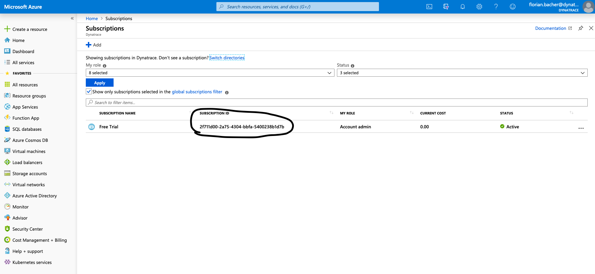
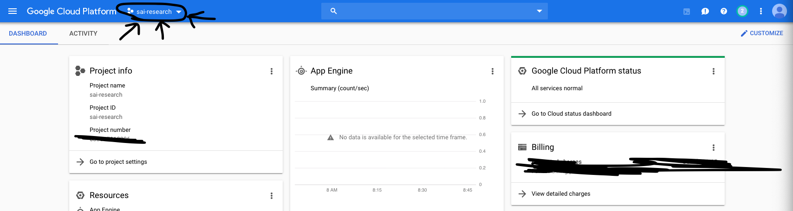
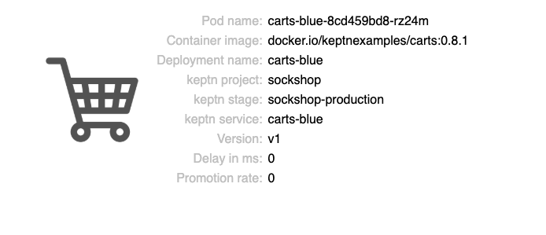

# keptn-hotday2020
Instructions for the HoT workshop "Intro to ACM with Keptn" given @Dynatrace Perform 2020

# Overview
In this workshop, you will get hands-on experience with the open source framework [keptn](https://keptn.sh), and see how it can help you to manage your cloud-native applications on Kubernetes

# Pre-requisites

## 1. Accounts

1. Dynatrace - Assumes you will use a [trial SaaS dynatrace tenant](https://www.dynatrace.com/trial) and created a PaaS and API token.  See details in the [keptn docs](https://keptn.sh/docs/0.4.0/monitoring/dynatrace/)
1. GitHub - Assumes you have a github account and a personal access token with the persmissions keptn expects. See details in the [keptn docs](https://keptn.sh/docs/0.4.0/installation/setup-keptn-gke/)
1. Cloud provider account.  Highly recommend to sign up for personal free trial as to have full admin rights and to not cause any issues with your enterprise account. Links to free trials
   * [Google](https://cloud.google.com/free/)
   * [Azure](https://azure.microsoft.com/en-us/free/)

## 2. Github Org

Keptn expects all the code repos and project files to be in the same GitHub Organization. So create a github new github organization for the keptn-orders for Keptn to use and for the keptn-orders application repos to be forked.  See details in the [github docs](https://github.com/organizations/new)

Suggested gihub organization name: ```<your last name>-keptn-hackfest-<cloud provider>``` for example ```bacher-keptn-hackfest-gcloud```

NOTE: If the 'orders-project' repo already exists in your personal github org, there may be errors when you onboard again.  So delete the repo if it exists.

## 3. Tools

In this workshop we are going to use a pre-built Docker image that already has the required tools installed. The only requirement is that you have Docker installed on your machine. You can install it using the instructions on the [Docker Homepage](https://docs.docker.com/install/)

# Provision Cluster, Install Keptn, and onboard the Carts application

Now it's time to set up your workshop environment. During the setup, you will need the following values. We recommend to copy the following lines into an editor, fill them out and keep them as a reference for later:

```
Dynatrace Host Name (e.g. abc12345.live.dynatrace.com):
Dynatrace API Token:
Dynatrace PaaS Token:
GitHub User Name:
GitHub Personal Access Token:
GitHub User Email:
GitHub Organization:
========Azure Only=========
Azure Subscription ID:
Azure Location: francecentral
========GKE Only===========
Google Project:
Google Cluster Zone: us-east1-b
Google Cluster Region: us-east1
```

The **Azure Subscription ID** can be found in your [Azure console](https://portal.azure.com/?quickstart=true#blade/Microsoft_Azure_Billing/SubscriptionsBlade):



The **Google Project** can be found at the top bar of your [GCP Console](https://console.cloud.google.com):




To start the docker container you will use for this workshop, please execute:

```
docker run -d -t bacherfl/keptn-demo
```

Afterwards, you can SSH into this container. First, retrieve the `CONTAINER_ID` of the `keptn-demo` container:

```
docker ps
```

Then, use that ID to SSH into the container:

```
docker exec -it <CONTAINER_ID> /bin/sh -c "[ -e /bin/bash ] && /bin/bash || /bin/sh"
```

When you are in the container, you need to log in to your PaaS account (GCP or AKS):

  - If you are using **GCP**, execute `gcloud init`
  - On **Azure**, execute `az login`

when is is done, navigate into the `scripts` folder:

```
cd scripts
```

Here you will find multiple scripts used for the setup and they must be run the right order.  Just run the setup script that will prompt you with menu choices.
```
./setup.sh <deployment type>
```
NOTE: Valid 'deployment type' argument values are:
* gke = Google
* aks = Azure

The setup menu should look like this:
```
====================================================
SETUP MENU for Azure AKS
====================================================
1)  Enter Installation Script Inputs
2)  Provision Kubernetes cluster
3)  Install Keptn
4)  Install Dynatrace
5)  Expose Keptn's Bridge
----------------------------------------------------
99) Delete Kubernetes cluster
====================================================
Please enter your choice or <q> or <return> to exit
```

## 1) Enter Installation Script Inputs

Before you do this step, be prepared with your github credentials, dynatrace tokens, and cloud provider project information available.

This will prompt you for values that are referenced in the remaining setup scripts. Inputted values are stored in ```creds.json``` file. For example on GKE the menus looks like:

```
===================================================================
Please enter the values for provider type: Google GKE:
===================================================================
Dynatrace Host Name (e.g. abc12345.live.dynatrace.com)
                                       (current: DYNATRACE_HOSTNAME_PLACEHOLDER) : 
Dynatrace API Token                    (current: DYNATRACE_API_TOKEN_PLACEHOLDER) : 
Dynatrace PaaS Token                   (current: DYNATRACE_PAAS_TOKEN_PLACEHOLDER) : 
GitHub User Name                       (current: GITHUB_USER_NAME_PLACEHOLDER) : 
GitHub Personal Access Token           (current: PERSONAL_ACCESS_TOKEN_PLACEHOLDER) : 
GitHub User Email                      (current: GITHUB_USER_EMAIL_PLACEHOLDER) : 
GitHub Organization                    (current: GITHUB_ORG_PLACEHOLDER) : 
Google Project                         (current: GKE_PROJECT_PLACEHOLDER) : 
Cluster Name                           (current: CLUSTER_NAME_PLACEHOLDER) : 
Cluster Zone (eg.us-east1-b)           (current: CLUSTER_ZONE_PLACEHOLDER) : 
Cluster Region (eg.us-east1)           (current: CLUSTER_REGION_PLACEHOLDER) :
```

## 2) Provision Kubernetes cluster

This will provision a Cluster on the specified cloud deployment type using the platforms CLI. This script will take several minutes to run and you can verify the cluster was created with the the cloud provider console.

The cluster will take 5-10 minutes to provision.

This script at the end will run the 'Validate Kubectl' script.  

## 3) Install Keptn

This will install the Keptn control plane components into your cluster.  The install will take 5-10 minutes to perform.

NOTE: Internally, this script will perform the following:
1. clone https://github.com/keptn/installer.  This repo has the cred.sav templates for building a creds.json file that the keptn CLI can use as an argument
1. use the values we already captured in the ```2-enterInstallationScriptInputs.sh``` script to create the creds.json file
1. run the ```keptn install -c=creds.json --platform=<Cluster>``` 
1. run the 'Show Keptn' helper script


## 4) Install Dynatrace
This will install the Dynatrace OneAgent Operator into your cluster.  The install will take 3-5 minutes to perform.

NOTE: Internally, this script will perform the following:
1. clone https://github.com/keptn/dynatrace-service.  This repo has scripts for each platform to install the Dyntrace OneAgent Operator and the cred_dt.sav template for building a creds_dt.json file that the install script expects to read
1. use the values we already captured in the ```1-enterInstallationScriptInputs.sh``` script to create the creds_dt.json file
1. run the ```/deploy/scripts/deployDynatraceOn<Platform>.sh``` script in the dynatrace-service folder
1. run the 'Show Dynatrace' helper script


## 5)  Expose Keptn's Bridge

The [keptn’s bridge](https://keptn.sh/docs/0.4.0/reference/keptnsbridge/) provides an easy way to browse all events that are sent within keptn and to filter on a specific keptn context. When you access the keptn’s bridge, all keptn entry points will be listed in the left column. Please note that this list only represents the start of a deployment of a new artifact and, thus, more information on the executed steps can be revealed when you click on one event.


In the default installation of Keptn, the bridge is only accessible via `kubectl port-forward`. To make things easier for workshop participants, we will expose it by creating a oublic URL for this component.

# Onboarding the carts service

Now that your environment is up and running and monitored by Dynatrace, you can proceed with onboarding the carts application into your cluster.
To do so, please follow these instructions:

1. Quit the setup script you were using to setup the infrastructure.
1. Navigate to the workshop directory:

  ```
  cd /usr/keptn/keptn-hackfest2019
  ```
1. Go to https://github.com/keptn-sockshop/carts and click on the **Fork** button on the top right corner.

  1. Select the GitHub organization you use for keptn.

  1. Clone the forked carts service to your local machine. Please note that you have to use your own GitHub organization.

  ```
  git clone https://github.com/your-github-org/carts.git
  ```


1. Change into the `keptn-onboarding` directory:

```
cd keptn-onboarding
```

1. Create the `sockshop` project:

```
keptn create project sockshop shipyard.yaml
```

This will create a configuration repository in your github repository. This repository will contain a branch for each of the stages defined in the shipyard file, in order to store the desired configuration of the application within that stage.

1. Since the `sockshop` project does not contain any services yet, it is time to onboard a service into the project. In this workshop, we will use a simple microservice that emulates the behavior of a shopping cart. This service is written in Java Spring and uses a mongoDB database to store data. To onboard the `carts` service, execute the following command:

```
keptn onboard service --project=sockshop --values=values_carts.yaml
```

To deploy the database, execute:

```
keptn onboard service --project=sockshop --values=values_carts_db.yaml --deployment=deployment_carts_db.yaml --service=service_carts_db.yaml
```

Now, your configuration repository contains all the information needed to deploy your application and even supports blue/green deployments for two of the environments (staging and production)!

# Deploying the carts service

To deploy the service into your cluster, you can use the keptn CLI to trigger a new deployment. To do so, please execute the following command on your machine:

```
keptn send event new-artifact --project=sockshop --service=carts --image=docker.io/keptnexamples/carts --tag=0.10.1
```

This will inform keptn about the availability of a new artifact (`keptnexamples/carts:0.10.1`). As a result, keptn will trigger a multi-stage deployment of that service. During the deployment of the service, a number of various different services that are responsible for different tasks are involved, such as:

  - **helm-service**: This service checks out the configuration repository and deploys the service using `helm`.
  - **jmeter-service**: Responsible for running jmeter tests which are specified in the code repository of the `carts` service.
  - **lighthouse-service**: Evaluates performance test runs, if quality gates are enabled (more on that later).
  - **gatekeeper-service**: Decides wether an artifact should be promoted into the next stage (e.g. from dev to staging), or if an artifact should be rejected.

To gain an overview of all services involved in the deployment/release of the service, you can use the **keptn's bridge**, which you have set up earlier.

# View the carts service

To make the carts service accesible from outside the cluster, and to support blue/green deployments, keptn automaticalliy creates Istio VirtualServices that direct requests to certain URLs to the correct service instance. You can retrieve the URLs for the carts service for each stage as follows:

```
echo http://carts.sockshop-dev.$(kubectl get cm keptn-domain -n keptn -o=jsonpath='{.data.app_domain}')
echo http://carts.sockshop-staging.$(kubectl get cm keptn-domain -n keptn -o=jsonpath='{.data.app_domain}')
echo http://carts.sockshop-production.$(kubectl get cm keptn-domain -n keptn -o=jsonpath='{.data.app_domain}')
```

Navigate to the URLs to inspect your carts service. In the production namespace, you should receive an output similar to this:



# Introducing quality gates

TODO

## Deployment of a slow implementation of the carts service

To demonstrate the benefits of having quality gates, we will now deploy a version of the carts service with a terribly slow response time. To trigger the deployment of this version, please execute the following command on your machine:

```
keptn send event new-artifact --project=sockshop --service=carts --image=docker.io/keptnexamples/carts --tag=0.10.2
```

After some time, this new version will be deployed into the `dev` stage. If you look into the `shipyard.yaml` file that you used to create the `sockshop` project, you will see that in this stage, only functional tests are executed. This means that even though version has a slow response time, it will be promoted into the `staging` environment, because it is working as expected on a functional level. You can verify the deployment of the new version into `staging` by navigating to the URL of the service in your browser using the following URL:

```
echo http://carts.sockshop-staging.$(kubectl get cm keptn-domain -n keptn -o=jsonpath='{.data.app_domain}')
```

On the info homepage of the service, the **Version** should now be set to **v2**, and the **Delay in ms** value should be set to **1000**. (Note that it can take a few minutes until this version is deployed after sending the `new-artifact` event.)

As soon as this version has been deployed into the `staging` environment, the `jmeter-service` will execute the performance tests for this service. When those are finished, the `pitometer-service` will evaluate them using Dynatrace as a data source. At this point, it will detect that the response time of the service is too high and mark the evaluation of the performance tests as `failed`.

As a result, the new artifact will not be promoted into the `production` stage. Additionally, the traffic routing within the `staging` stage will be automatically updated in order to send requests to the previous version of the service. You can again verify that by navigating to the service homepage and inspecting the **Version** property. This should now be set to **v1** again.
