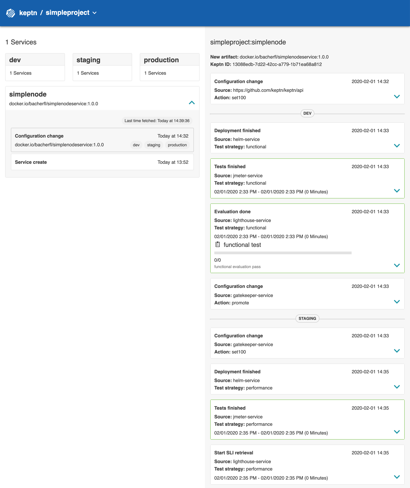
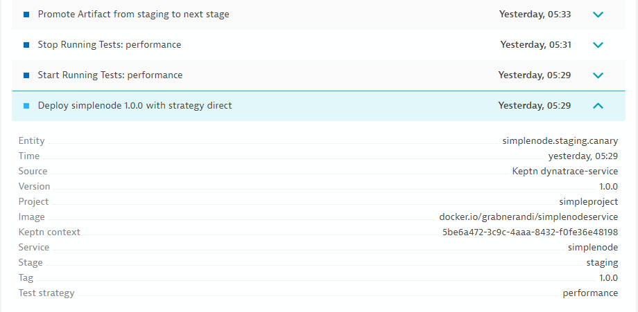
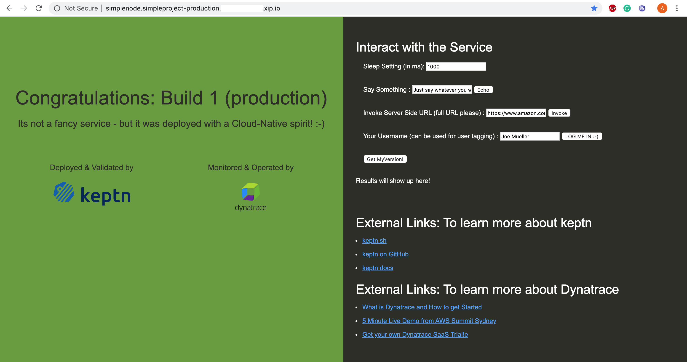

# keptn-hotday2020
Instructions for the HoT workshop "Intro to ACM with Keptn" given @Dynatrace Perform 2020

# Overview
In this workshop, you will get hands-on experience with the open source framework [keptn](https://keptn.sh), and see how it can help you to manage your cloud-native applications on Kubernetes

# Pre-requisites

## 1. Accounts

1. Dynatrace - Assumes you will use a [trial SaaS dynatrace tenant](https://www.dynatrace.com/trial). You will get your Dynatrace Tenant credentials during the workshop.
1. GitHub Account (optional)
1. GKE Cluster - you will get the access information during the workshop


## 2. Git Repo (optional, but recommended)
Keptn installs its own Git. In order to modify SLIs & SLOs that are managed by keptn we will define a remote git upstream. Feel free to use GitHub, GitLab, Bitbucket or any other Git service. What you need are these 3 things
1. **GIT_REMOTE_URL**: Create a Remote Git Hub Repo that includes a Readme.md
2. **GIT_USER**: Your git user to login
3. **GIT_TOKEN**: A token for your git that allows keptn to push updates to that repo

You can create the GitHub Token as follows:


## 3. Dynatrace Token
This example shows keptn quality gates based on Dynatrace metrics using the new [Dynatrace Metrics v2 API](https://www.dynatrace.com/support/help/extend-dynatrace/dynatrace-api/environment-api/metric/).
Hence you need Dynatrace that instruments the services you want to validate SLOs against. In order for keptn to automate that validation we need two things:
1. **Dynatrace URL**: Thats e.g: https://abc12345.dynatrace.live.com (for SaaS) or your https://managedservice/e/yourenvioronment (for Managed)
2. **Dynatrace API Token**: Please create a Dynatrace API token with access to timeseries as well as read & write configuration (for my advanced service metric SLIs)
3. **Dynatrace PAAS API Token**: Please create a Dynatrace PaaS token which will be used to rollout the OneAgent on your EKS cluster

## 4. Tools

On the bastion host you are using during the workshop, all required tools (i.e. **kubectl** and **keptn**) are already installed

## Environment Setup

Now it's time to set up your workshop environment. During the setup, you will need the following values. We recommend to copy the following lines into an editor, fill them out and keep them as a reference for later:

```
Dynatrace Host Name (e.g. abc12345.live.dynatrace.com):
Dynatrace API Token:
Dynatrace PaaS Token:
GitHub User Name:
GitHub Personal Access Token:
GitHub User Email:
GitHub Organization:
```

### Install Keptn

This will install the Keptn control plane and uniform components into your cluster.  The install will take 5-10 minutes to perform.
To start the installation, please execute

```
keptn install --platform=gke --keptn-version=release-0.6.0.beta2
```

### Install Dynatrace
To install Dynatrace, we will use the `dynatrace-service` that can be installed as an add-on for Keptn. This service will do the following things:

    - Deploy the Dynatrace OneAgent to gain monitoring insights for your entire cluster
    - Create Auto-Tagging rules which will be used by Keptn
    - Set up customized problem notifications that can be sent to and interpreted by Keptn.
    - Automatically create Management Zones for your Keptn projects
    - Automatically create Dashboards for your Keptn projects
    
To perform correctly, the dynatrace-service requires the **Dynatrace Tenant**, the **API Token**, and the **PaaS Token**. To store these attributes in the cluster as a Kubernetes secret, 
perform the following command after replacing the placeholders for :

```
kubectl -n keptn create secret generic dynatrace --from-literal="DT_API_TOKEN=<DT_API_TOKEN_PLACEHOLDER>" --from-literal="DT_TENANT=<DT_TENANT_PLACEHOLDER>" --from-literal="DT_PAAS_TOKEN=<DT_PAAS_TOKEN_PLACEHOLDER>"
```

When the secret has been created successfully, you can install the dynatrace-service:

```
kubectl apply -f https://raw.githubusercontent.com/keptn-contrib/dynatrace-service/master/deploy/manifests/dynatrace-service/dynatrace-service.yaml
```

When the service has been created, wait until the `dynatrace-sercvice` pod in the `keptn` namespace has the status `Running`:

```
$ kubectl get pods -n keptn -w |grep dynatrace
dynatrace-service-67bc686bc-vtpnx                                 1/1     Running   0          46h
dynatrace-service-distributor-6d6d6c5478-krcws                    1/1     Running   0          47h
```

Afterwards, execute the command 

```
keptn configure monitoring dynatrace
```

This will instruct the dynatrace service to install the Dynatrace OneAgent on your cluster. Now your cluster is monitored by Dynatrace!

### Install Dynatrace SLI Service

During the workshop we will use quality gates to ensure only artifacts that meet our performance requirements are pushed through to production.
We will retrieve the relevant Service Level Indicator values via the Dynatrace SLI Service that grabs those values from the new Dynatrace metrics API.
To install the service, use `kubectl` to deploy it into your cluster:

```
kubectl apply -f https://raw.githubusercontent.com/keptn-contrib/dynatrace-sli-service/0.2.0/deploy/service.yaml
kubectl apply -f https://github.com/keptn-contrib/dynatrace-sli-service/raw/0.2.0/deploy/distributor.yaml
```

## 5)  Expose Keptn's Bridge

The [keptn’s bridge](https://keptn.sh/docs/0.6.0/reference/keptnsbridge/) provides an easy way to browse all events that are sent within keptn and to filter on a specific keptn context. When you access the keptn’s bridge, all keptn entry points will be listed in the left column. Please note that this list only represents the start of a deployment of a new artifact and, thus, more information on the executed steps can be revealed when you click on one event.


In the default installation of Keptn, the bridge is only accessible via `kubectl port-forward`. To make things easier for workshop participants, we will expose it by creating a public URL for this component.

```
cd keptn
./exposeBridge.sh
```
You should now be able to access the Keptns Bridge via the URL shown in the exposeBridge.sh output


# Onboarding the simplenode service

Now that your environment is up and running and monitored by Dynatrace, you can proceed with onboarding the simplenode application into your cluster.
To do so, please follow these instructions:

1. First, we will create a new project called **simpleproject** that will contain our **simplenode** service. Using the **shipyard.yaml** file, we will define our stages (dev, staging, production) we want to use for this project:

    ```
    keptn create project simpleproject --shipyard=./shipyard.yaml
    ```

1. At this point, the project does not contain any deployable services yet. Therefore, we now have to onboard our **simplenode** service:

    ```
    keptn onboard service simplenode --project=simpleproject --chart=./simplenode
    ```
   
1. Now the service is onboarded, and you can view the configuration files that Keptn has generated in your GitHub repository that you have set up earlier. For each stage we have defined in our shipyard.yaml, there will be a branch that holds the configuration for the 
application running in that stage. Each change made to the configuration will be made through a git commit, which will make it easy to track every change that has been done to the configuration!

1. At this point, it is time to set up our test files (we will use jmeter for testing), and our Service Level Objectives. After all, we do not want to blindly send artifacts into production, but want to ensure that our performance criteria are met:

   ```
   keptn add-resource --project=simpleproject --service=simplenode --stage=dev --resource=jmeter/basiccheck.jmx --resourceUri=jmeter/basiccheck.jmx
   keptn add-resource --project=simpleproject --service=simplenode --stage=dev --resource=jmeter/load.jmx --resourceUri=jmeter/load.jmx
   
   keptn add-resource --project=simpleproject --service=simplenode --stage=staging --resource=jmeter/basiccheck.jmx --resourceUri=jmeter/basiccheck.jmx
   keptn add-resource --project=simpleproject --service=simplenode --stage=staging --resource=jmeter/load.jmx --resourceUri=jmeter/load.jmx
   
   keptn add-resource --project=simpleproject --service=simplenode --stage=production --resource=jmeter/basiccheck.jmx --resourceUri=jmeter/basiccheck.jmx
   keptn add-resource --project=simpleproject --service=simplenode --stage=production --resource=jmeter/load.jmx --resourceUri=jmeter/load.jmx
   
   keptn add-resource --project=simpleproject --service=simplenode --stage=staging --resource=slo.yaml
   ```
   
1. Now, we will tell Keptn to use the **dynatrace-sli-service** as a value provider for our Service Level Indicators. We will do this using a ConfigMap:

   ```
   kubectl apply -f lighthouse-config.yaml
   ```
1. We are now ready and can run a new deployment
   
   ```
   keptn send event new-artifact --project=simpleproject --service=simplenode --image=docker.io/grabnerandi/simplenodeservice --tag=1.0.0
   ```
   
   As the deployment runs you can watch the progress
   **a) through the keptns bridge**
   
   
   **b) through Dynatrace events**
   The Dynatrace Service has pushed events to those -Dynatrace Service entities that match the keptn_project, keptn_service, keptn_stage and keptn_deployment tags:
   

# View the simplenode service

To make the simplenode service accesible from outside the cluster, and to support blue/green deployments, keptn automaticalliy creates Istio VirtualServices that direct requests to certain URLs to the correct service instance. You can retrieve the URLs for the simplenode service for each stage as follows:

```
echo http://simplenode.simpleproject-dev.$(kubectl get cm keptn-domain -n keptn -o=jsonpath='{.data.app_domain}')
echo http://simplenode.simpleproject-staging.$(kubectl get cm keptn-domain -n keptn -o=jsonpath='{.data.app_domain}')
echo http://simplenode.simpleproject-production.$(kubectl get cm keptn-domain -n keptn -o=jsonpath='{.data.app_domain}')
```

Navigate to the URLs to inspect your simplenode service. In the production namespace, you should receive an output similar to this:




## Deployment of a slow implementation of the simplenode service

To demonstrate the benefits of having quality gates, we will now deploy a version of the simplenode service with a terribly slow response time. To trigger the deployment of this version, please execute the following command on your machine:

```
keptn send event new-artifact --project=simpleproject --service=simplenode --image=docker.io/keptnexamples/simplenode --tag=0.10.2
```

After some time, this new version will be deployed into the `dev` stage. If you look into the `shipyard.yaml` file that you used to create the `simpleproject` project, you will see that in this stage, only functional tests are executed. This means that even though version has a slow response time, it will be promoted into the `staging` environment, because it is working as expected on a functional level. You can verify the deployment of the new version into `staging` by navigating to the URL of the service in your browser using the following URL:

```
echo http://simplenode.simpleproject-staging.$(kubectl get cm keptn-domain -n keptn -o=jsonpath='{.data.app_domain}')
```

On the info homepage of the service, the **Version** should now be set to **v2**, and the **Delay in ms** value should be set to **1000**. (Note that it can take a few minutes until this version is deployed after sending the `new-artifact` event.)

As soon as this version has been deployed into the `staging` environment, the `jmeter-service` will execute the performance tests for this service. When those are finished, the `pitometer-service` will evaluate them using Dynatrace as a data source. At this point, it will detect that the response time of the service is too high and mark the evaluation of the performance tests as `failed`.

As a result, the new artifact will not be promoted into the `production` stage. Additionally, the traffic routing within the `staging` stage will be automatically updated in order to send requests to the previous version of the service. You can again verify that by navigating to the service homepage and inspecting the **Version** property. This should now be set to **v1** again.
