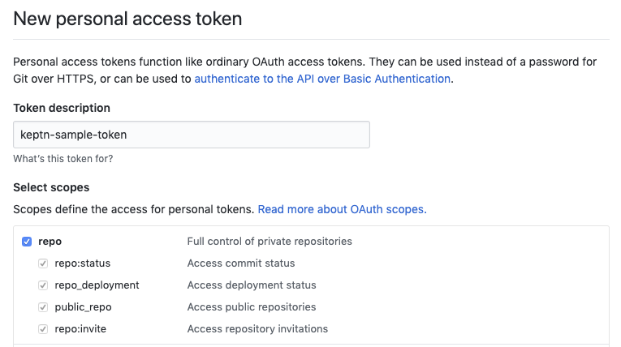
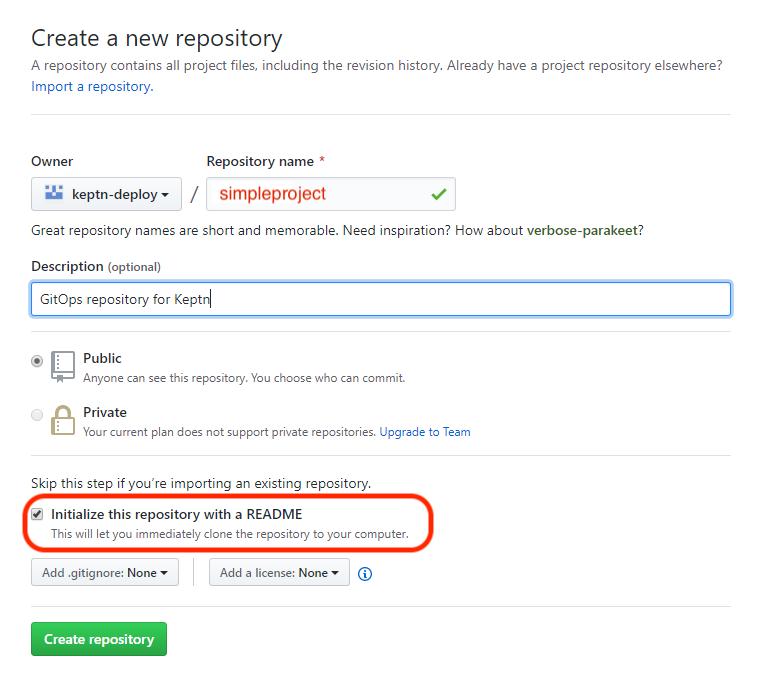
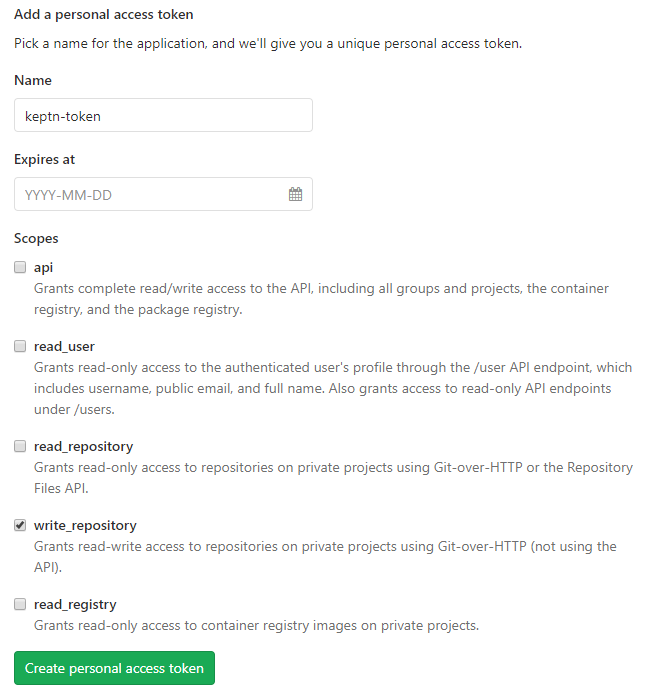
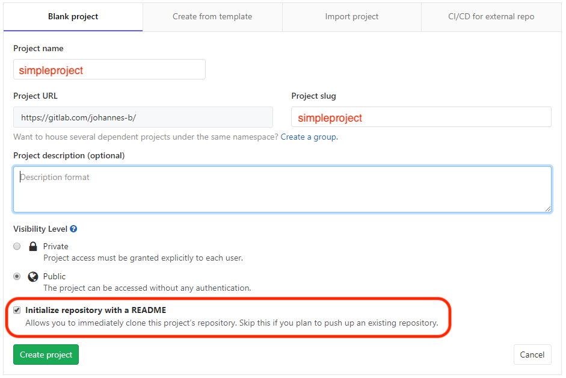
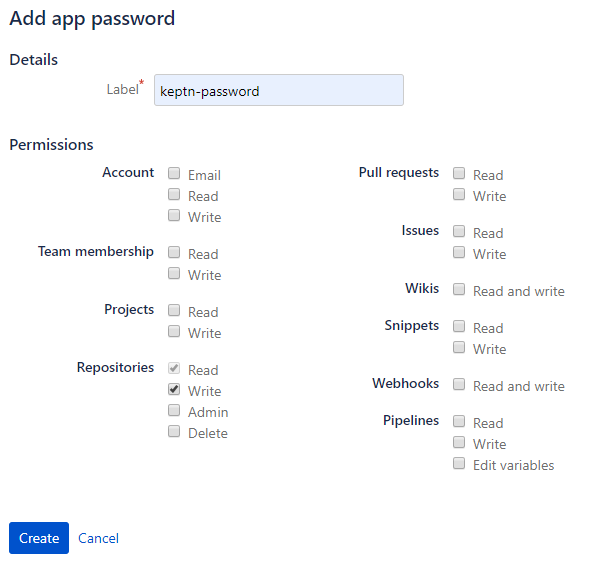
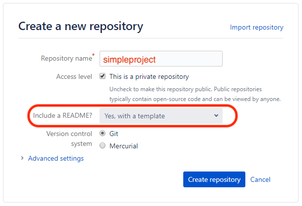
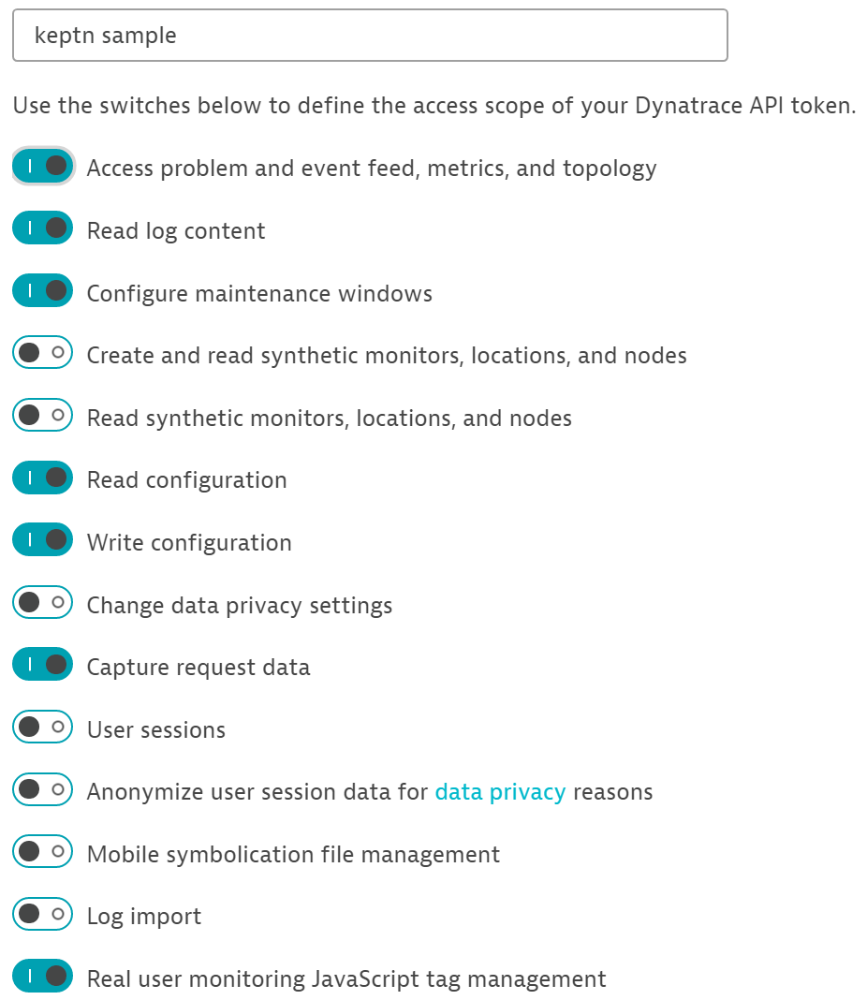
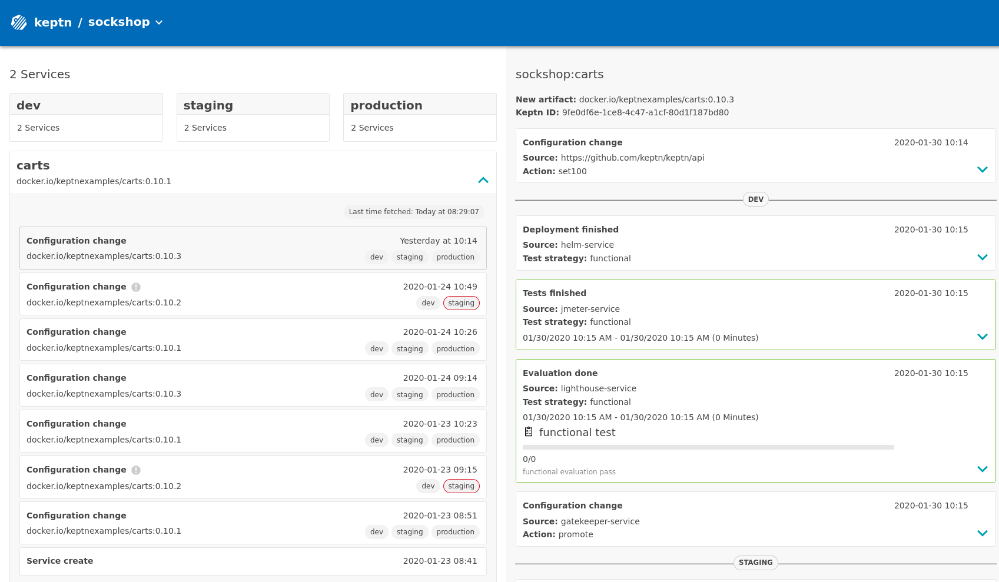

**Introduction to Autonomous Cloud with Keptn** workshop given @Dynatrace Perform 2020

# Overview
In this workshop, you will get hands-on experience with the open-source framework [keptn](https://keptn.sh) and see how it can help you to manage your cloud-native applications on Kubernetes.

* For a great workshop experience, we ask you to keep track of your completed tasks. Therefore, please open this [spreadsheet](https://docs.google.com/spreadsheets/d/1V1sRCdVdSlwzbYCTfcRKIAfkDw0lLckGpSREGlW3khM/edit?usp=sharing) and enter your name.

# Pre-requisites

## 1. Accounts

1. **GKE Cluster** - You will get the access information during the workshop.
1. **GitHub, GitLab, or Bitbucket** - Please use your account.
1. **Dynatrace** - You will get your Dynatrace Tenant credentials during the workshop.

During the **Setup**, you will need Git and Dynatrace tokens.
We recommend to copy the following lines into an editor and fill them out while working through the
pre-requisites:
```
Git remote repo-URL:
Git user:
Git token:

Dynatrace Tenant URL: 
Dynatrace API token:
Dynatrace PaaS token:
```

## 2. Git Repo
Keptn installs its own Git repo for storing the configuration. In order to
read and modify the configuration (e.g., Helm charts, SLIs, SLOs),
Keptn requires a remote Git upstream.
Feel free to use GitHub, GitLab, or Bitbucket.

For obtaining the required *remote repo-URL*, *user*, and *token*, 
please follow the instructions depending on your provider.

<details><summary>GitHub</summary>
<p>

1. If you do not have a GitHub user, create a user by [signing up](https://github.com/join?source=header-home). 

1. Create a [personal access token](https://help.github.com/en/articles/creating-a-personal-access-token-for-the-command-line) for your user with *repo* scope:

    

1. (optional) If you want to use a dedicated GitHub organization for your repository, create a [GitHub organization](https://github.com/organizations/new).

1. Go to your account or your GitHub organization and create a [GitHub repository](https://help.github.com/en/articles/create-a-repo).

    **Note:** Click the **Initialize this repository with a README** checkbox to initialize the repository, which is a prerequisite.

    

</p>
</details>

<details><summary>GitLab</summary>
<p>

1. If you do not have a GitLab user, create a user by [signing up for a free trial](https://customers.gitlab.com/trials/new?gl_com=true). 

1. Create a [personal access token](https://docs.gitlab.com/ee/user/profile/personal_access_tokens.html) for your user with *write_repo* scope:

    

1. Go to your account and create a [GitLab project](https://docs.gitlab.com/ee/gitlab-basics/create-project.html).

    **Note:** Click the **Initialize this repository with a README** checkbox to initialize the repository, which is a prerequisite.

    
    
</p>
</details>

<details><summary>Bitbucket</summary>
<p>

1. If you do not have a Bitbucket user, create a user by [signing up for a free trial](https://bitbucket.org/account/signup/). 

1. Create an [app password](https://docs.gitlab.com/ee/user/profile/personal_access_tokens.html) for your user with *Write* permissions. Therefore, select your User > **View profile** > **Settings** > **App passwords** > **Create app password**

    

1. Go to your account and create a [Bitbucket repository](https://docs.gitlab.com/ee/gitlab-basics/create-project.html).

    **Note:** Select *Include a README?* - **Yes, with a template** to initialize the repository, which is a prerequisite.

    

</p>
</details>

## 3. Dynatrace Tokens
This workshop explores Keptn's quality gates using metrics from Dynatrace.
In order to query the metrics, Keptn requires access to the Dynatrace API.
Therefore, please follow the instructions:

1. Create a **Dynatrace API** token:

    Log in to your Dynatrace tenant and go to **Settings > Integration > Dynatrace API**. Then, create a new API token with the following permissions:

    - Access problem and event feed, metrics and topology
    - Access logs
    - Configure maintenance windows
    - Read configuration
    - Write configuration
    - Capture request data
    - Real user monitoring JavaScript tag management

    *Permissions of the token:*

    

1. Create a **Dynatrace PaaS** token:

    Log in to your Dynatrace tenant, go to **Settings > Integration > Platform as a Service** and create a new PaaS token.

# Setup

## 1. Login on your Bastion host
For this lab, we have set up a Bastion host for each participant. 
This host has all required CLI tools (e.g. **kubectl** and **keptn**) installed,
so you don't have to install it on your machine. 

* To log in on the Bastion host via your web browser, please follow the instructions provided by the lab instructors.

## 2. Check out the workshop repository

* Please check out the workshop repository from GitHub by  
executing the following command on the Bastion host:

    ```
    git clone https://github.com/keptn-workshops/getting-started
    cd getting-started
    ```

## 3. Install Keptn

* Install the Keptn control plane into your GKE cluster by using the installed Keptn CLI.
The installation process promotes you for for the Cluster Name, Cluster Zone, and GKE Project. Here, please use the the suggest values (i.e. confirm by pressing Enter).

    ```
    keptn install --platform=gke
    ```
The installation will take 5-10 minutes to perform.

## 4. Enable Dynatrace Monitoring

For enabling Dynatrace monitoring, you will utilize the so-called `dynatrace-service`, which can be installed as an add-on for Keptn.
This service will:
- deploy the *Dynatrace OneAgent* to gain monitoring insights for your entire cluster,
- create *Auto-Tagging* rules which will be used by Keptn,
- set up customized *Problem notifications* that are sent to Keptn,
- create *Management zones* for your Keptn projects, and
- create *Dashboards* for your Keptn projects.
    
1. The `dynatrace-service` requires the **Dynatrace Tenant**, the **API Token**, and the **PaaS Token** as a Kubernetes secret. To create this secret, execute the following command after replacing the placeholders `<DT_API_TOKEN_PLACEHOLDER>`, `<DT_TENANT_PLACEHOLDER>`, and `<DT_PAAS_TOKEN_PLACEHOLDER>` with your credentials:

    ```
    kubectl -n keptn create secret generic dynatrace --from-literal="DT_API_TOKEN=<DT_API_TOKEN_PLACEHOLDER>" --from-literal="DT_TENANT=<DT_TENANT_PLACEHOLDER>" --from-literal="DT_PAAS_TOKEN=<DT_PAAS_TOKEN_PLACEHOLDER>"
    ```

1. Install the `dynatrace-service` in your cluster by executing the following command:

    ```
    kubectl apply -f https://raw.githubusercontent.com/keptn-contrib/dynatrace-service/0.6.0/deploy/manifests/dynatrace-service/dynatrace-service.yaml
    ```

1. After installing the `dynatrace-service`, wait until the `dynatrace-service` pod in the `keptn` namespace has the status `Running`:

    ```
    $ kubectl get pods -n keptn -w |grep dynatrace
    dynatrace-service-67bc686bc-vtpnx                                 1/1     Running   0          46h
    dynatrace-service-distributor-6d6d6c5478-krcws                    1/1     Running   0          47h
    ```

1. Instruct the `dynatrace-service` to install monitoring in your cluster by executing the following command:

    ```
    keptn configure monitoring dynatrace
    ```

## 5. Install Dynatrace SLI Service

During the workshop, you will use quality gates to ensure only artifacts that meet performance requirements are pushed through to production.
A Keptn service called `dynatrace-sli-service` 
will retrieve the relevant *Service Level Indicators* (SLIs) from the new [Dynatrace Metrics API](https://www.dynatrace.com/support/help/extend-dynatrace/dynatrace-api/environment-api/metric/).

* Install the `dynatrace-sli-service` in your cluster by executing the following command:

    ```
    kubectl apply -f https://raw.githubusercontent.com/keptn-contrib/dynatrace-sli-service/0.3.0/deploy/service.yaml
    ```

## 6. Expose Keptn's Bridge

The [Keptn’s Bridge](https://keptn.sh/docs/0.6.0/reference/keptnsbridge/#early-access-version-of-keptn-s-bridge) provides 
an overview of projects, services and all events that are sent within Keptn.
<!-- When you access the Keptn’s bridge, all deployments of a new artifact will be listed in the left column. All events belonging to the deployment of an artifact can then be shown by clicking on one event. -->



In the default installation of Keptn, the Bridge is not accessible via a public URL because it may contain sensitive information. But for this workshop, expose the Bridge by executing the following command:

* Please change the directory to: 

    ```
    cd ~/getting-started/keptn
    ```

* Execute the script `exposeBridge.sh`: 

    ```
    ./exposeBridge.sh
    ```

:mag: You should now be able to access the Keptn's Bridge via the URL shown in the exposeBridge.sh output:


# Hands-on Labs

After installing Keptn, you are now ready to explore to execute the following hands-on labs. They are based on each other, why it is important to complete the according to this order:

1. Onboarding the simplenode service: [Lab](./01_Onboarding_simplenode_service)
1. Deploying the simplenode service: [Lab](./02_Deploying_simplenode_service)
1. Exploring quality gates: [Lab](./03_Exploring_quality_gates)
1. Optional: Automatic remediation: [Lab](./04_Automatic_remediation)

# Keptn Community

Join the Keptn community!

Further information about Keptn can be found on the [keptn.sh](keptn.sh) website. Keptn itself lives on [GitHub](https://github.com/keptn/keptn).

**Feel free to contribute or reach out to the Keptn team using a channel provided [here](https://github.com/keptn/community)**.