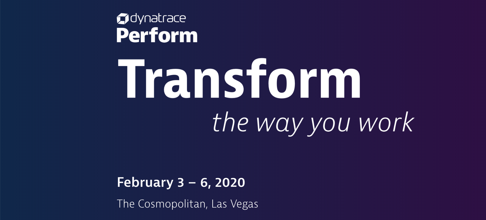
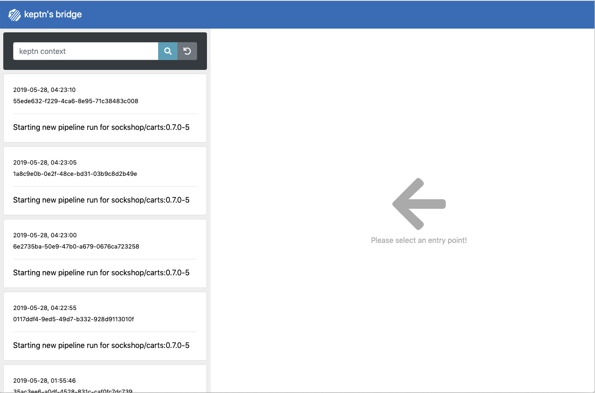

**Introduction to Autonomous Cloud with Keptn** workshop given @Dynatrace Perform 2020

# Overview
In this workshop, you will get hands-on experience with the open source framework [keptn](https://keptn.sh) and see how it can help you to manage your cloud-native applications on Kubernetes.

1. For a great workshop experience, we ask you to keep track of your completed tasks. Therefore, please open this [spreadsheet](https://docs.google.com/spreadsheets/d/1V1sRCdVdSlwzbYCTfcRKIAfkDw0lLckGpSREGlW3khM/edit?usp=sharing) and enter your name.

# Pre-requisites

## 1. Accounts

1. **Dynatrace** - Assumes you will use a [trial SaaS Dynatrace tenant](https://www.dynatrace.com/trial). You will get your Dynatrace Tenant credentials during the workshop.
1. **GitHub, GitLab, Bitbucket or any other Git service account** (optional)
1. **GKE Cluster** - you will get the access information during the workshop


## 2. Git Repo (optional, but recommended)
Keptn installs its own Git repo. In order to modify SLIs & SLOs that are managed by Keptn, we will define a remote Git upstream. Feel free to use GitHub, GitLab, Bitbucket or any other Git service. What you need are these 3 things
1. **GIT_REMOTE_URL**: Create a remote Git repo that includes a Readme.md
2. **GIT_USER**: Your Git user to login
3. **GIT_TOKEN**: A token for your Git that allows Keptn to push updates to that repo

You can create the GitHub repo as follows:


## 3. Dynatrace Token
This workshop shows Keptn quality gates based on Dynatrace metrics using the new [Dynatrace Metrics v2 API](https://www.dynatrace.com/support/help/extend-dynatrace/dynatrace-api/environment-api/metric/).
Hence, you need Dynatrace that instruments the services you want to validate SLOs against. In order for Keptn to automate that validation we need two things:
1. **Dynatrace URL**: That's e.g: https://abc12345.dynatrace.live.com (for SaaS) or your https://managedservice/e/yourenvioronment (for Managed)
2. **Dynatrace API Token**: Please create a Dynatrace API token with access to timeseries as well as read & write configuration (for my advanced service metric SLIs)
3. **Dynatrace PAAS API Token**: Please create a Dynatrace PaaS token which will be used to rollout the OneAgent on your EKS cluster

## 4. Tools

On the bastion host you are using during the workshop, all required tools (i.e. **kubectl** and **keptn**) are already installed

## Environment Setup

For this lab, We have set up a Bastion host for each participant. This host has all required CLI tools (e.g. kubectl and keptn) installed,
so you don't have to install it on your machine. To log in on the bastion host via your web browser, please follow the instructions of the lab instructors.

When you have logged in, the first thing to do is to check out the workshop repository from GitHub. To do so, please execute the following command on the bastion host:

```
git clone https://github.com/keptn-workshops/getting-started
cd getting-started
```

Now it's time to set up your workshop environment. 
During the setup, you will need the following values. 
We recommend to copy the following lines into an editor, 
fill them out and keep them as a reference for later:

```
Dynatrace Host Name (e.g. abc12345.live.dynatrace.com):
Dynatrace API Token:
Dynatrace PaaS Token:
GitHub User Name:
GitHub Personal Access Token:
GitHub User Email:
GitHub Organization:
```

### Install Keptn

This will install the Keptn control plane and uniform components into your cluster.  The install will take 5-10 minutes to perform.
To start the installation, please execute

```
keptn install --platform=gke
```

### Install Dynatrace
To install Dynatrace, we will use the `dynatrace-service` that can be installed as an add-on for Keptn. This service will do the following things:

    - Deploy the Dynatrace OneAgent to gain monitoring insights for your entire cluster
    - Create Auto-Tagging rules which will be used by Keptn
    - Set up customized problem notifications that can be sent to and interpreted by Keptn
    - Automatically create Management Zones for your Keptn projects
    - Automatically create Dashboards for your Keptn projects
    
To perform correctly, the dynatrace-service requires the **Dynatrace Tenant**, the **API Token**, and the **PaaS Token**. To store these attributes in the cluster as a Kubernetes secret, 
perform the following command after replacing the placeholders:

```
kubectl -n keptn create secret generic dynatrace --from-literal="DT_API_TOKEN=<DT_API_TOKEN_PLACEHOLDER>" --from-literal="DT_TENANT=<DT_TENANT_PLACEHOLDER>" --from-literal="DT_PAAS_TOKEN=<DT_PAAS_TOKEN_PLACEHOLDER>"
```

When the secret has been created successfully, you can install the dynatrace-service:

```
kubectl apply -f https://raw.githubusercontent.com/keptn-contrib/dynatrace-service/0.6.0/deploy/manifests/dynatrace-service/dynatrace-service.yaml
```

When the service has been created, wait until the `dynatrace-service` pod in the `keptn` namespace has the status `Running`:

```
$ kubectl get pods -n keptn -w |grep dynatrace
dynatrace-service-67bc686bc-vtpnx                                 1/1     Running   0          46h
dynatrace-service-distributor-6d6d6c5478-krcws                    1/1     Running   0          47h
```

Afterwards, execute the command 

```
keptn configure monitoring dynatrace
```

This will instruct the dynatrace service to install the Dynatrace OneAgent on your cluster. Now your cluster is monitored by Dynatrace!

### Install Dynatrace SLI Service

During the workshop, we will use quality gates to ensure only artifacts that meet our performance requirements are pushed through to production.
We will retrieve the relevant Service Level Indicator values via the Dynatrace SLI Service that grabs those values from the new Dynatrace metrics API.
To install the service, use `kubectl` to deploy it into your cluster:

```
kubectl apply -f https://raw.githubusercontent.com/keptn-contrib/dynatrace-sli-service/0.3.0/deploy/service.yaml
```

## 5)  Expose Keptn's Bridge

The [Keptn’s bridge](https://keptn.sh/docs/0.6.0/reference/keptnsbridge/) provides an easy way to browse all events that are sent within Keptn. When you access the Keptn’s bridge, all deployments of a new artifact will be listed in the left column. All events belonging to the deployment of an artifact can then be revealed by click on one event.



In the default installation of Keptn, the bridge is only accessible via `kubectl port-forward`. To make things easier for workshop participants, we will expose it by creating a public URL for this component.

```
cd ~/getting-started/keptn
./exposeBridge.sh
cd ..
```
You should now be able to access the Keptns Bridge via the URL shown in the exposeBridge.sh output


# Hands-on Labs

After installing Keptn, we are now ready to explore to execute the following hands-on labs. They are based on each other, why it is important to complete the according to this order:

1. Onboarding the simplenode service: [Lab](./01_Onboarding_simplenode_service)
1. Deploying the simplenode service: [Lab](./02_Deploying_simplenode_service)
1. Exploring quality gates: [Lab](./03_Exploring_quality_gates)
1. Optional: Automatic remediation: [Lab](./04_Automatic_remediation)

# Keptn Community

Join the Keptn community!

Further information about Keptn can be found on the [keptn.sh](keptn.sh) website. Keptn itself lives on [GitHub](https://github.com/keptn/keptn).

**Feel free to contribute or reach out to the Keptn team using a channel provided [here](https://github.com/keptn/community)**.